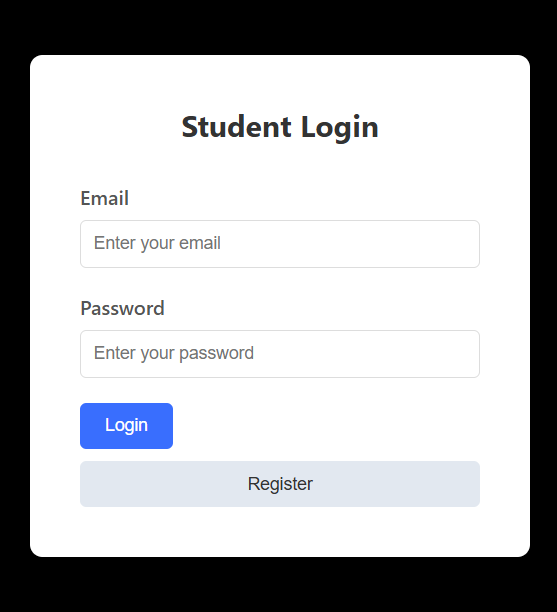
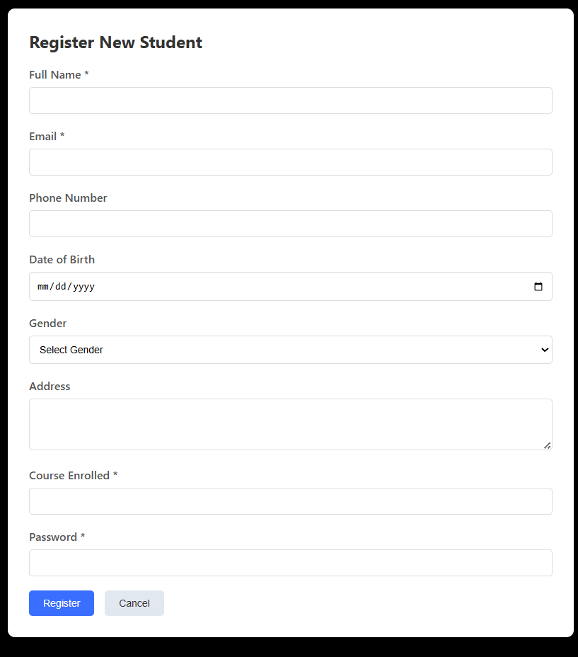
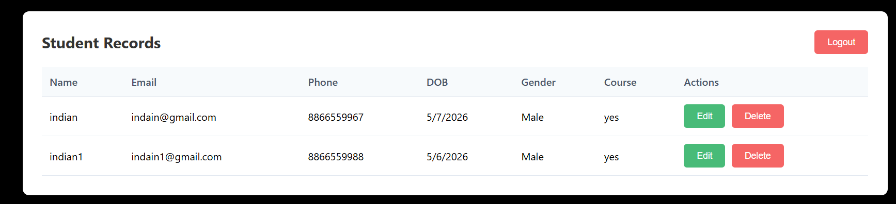

## Overview
Login & Student Registration form with CRUD operations, but with
2-level encryption.

## Features
- 2-Level Encryption 
- CRUD Operations
- Secure Login System
- Student Registration Form
- Student List Management
- Encrypted Data Storage

## Technology Stack
- **Frontend**: React, TypeScript, Axios
- **Backend**: Node.js, Express, TypeScript
- **Database**: MongoDB
- **Encryption**: crypto (AES)

## Installation

### Prerequisites
- Node.js (v14 or higher)
- MongoDB
- npm

### Server Setup
```bash
cd server
npm install
npm run dev

### Client Setup
```bash
cd client
npm install
npm run dev



